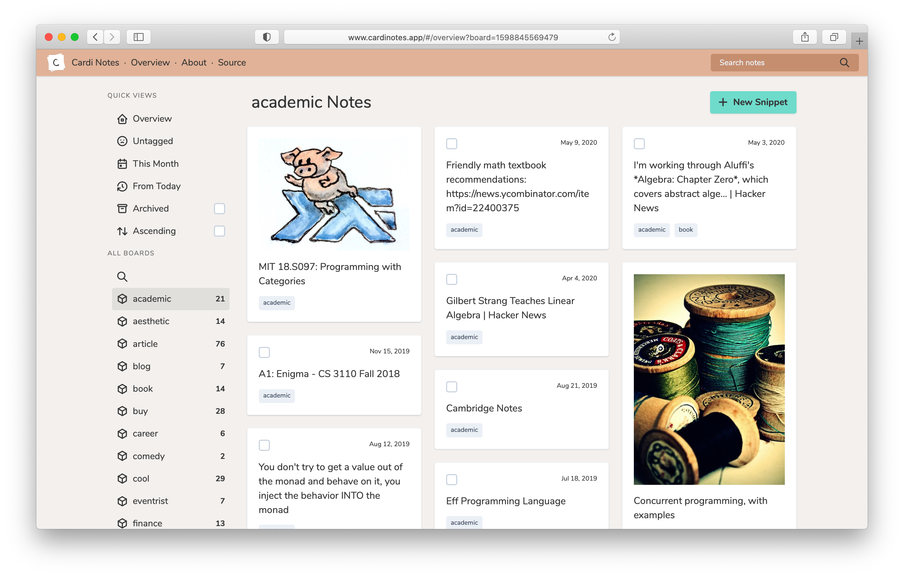

# Cardi Notes

[Cardi Notes](https://www.cardinotes.app/) is a new kind of note keeping tool -- with all data privately stored in your own AWS account, accessible on any device without maintaining your own server, completely open-source and free to use.

## Overview

You can think of Cardi as Google Keep, but without the Google.

My goal in creating and open-sourcing Cardi is to make it **as easy as possible** to move personal note-keeping off of a third-party cloud and into a private data store to which only you have access.

The implementation is currently more technical than I'd like -- it requires a personal AWS account, where notes are stored in a private DynamoDB table and queried directly by a static frontend using AWS access keys like a username and password. However, I think it's unique at least, and the advantage of a self-hosted note application that's both maintenance-free and actually-free is undeniable.

You can read more about Cardi in [the wiki](https://github.com/pickledish/cardi/wiki/About).

## Quick Start

In order to start using Cardi to keep notes, the process is short and simple:

1. Make sure you've created a personal AWS account
    - If you're not up for learning a bit about AWS, that's ok, but may want to try a different solution for now
1. Follow along with the [setup guide](https://github.com/pickledish/cardi/wiki/Setup) to create necessary AWS access keys
    - These keys are only ever stored in your own browser and sent to AWS, **never anywhere else**
1. Visit [cardinotes.app](https://www.cardinotes.app) and allow it to use the credentials you just created
    - This will automatically create the necessary DynamoDB tables when you first log in

## Application Features

- Full markdown support in note content
- Assign a note to any number of "boards" (i.e. tags) for simple organization
- Ability to archive notes that are no longer relevant
- Automatic fetching of HTML titles and images for URL notes
- Quick filters based on board or date of note creation
- Support for batch archival and tag modification
- Works in all major browsers, and phones as a Progressive Web App
- Dark mode!

## Technical Features

- Fully automated integration testing and deployment
- Statically generated site (see [JAMStack](https://jamstack.org/) for more info), hosted on Netlify
- Minimal bundle size, with no tracking or analytics
- All benefits of having data stored in a DynamoDB table, including:
  - Point in Time Recovery available
  - Fully encrypted at rest
  - Easy export and restore of notes to JSON or CSV
  - Easy direct administration when needed

## Development

**Requires `npm` version 6.14 or greater to build**

This project is mainly a single-page application, taking advantage of the fantastic open-source libraries [Svelte](https://svelte.dev) to define and build the individual components, [Tailwind](https://tailwindcss.com) for the styling, and [Rollup.js](https://rollupjs.org) as the build system and bundler. This is a pretty standard javascript setup, so you can use `npm install` to install dependencies for the project and `npm run dev` to start a local (live-reloading) server for real-time development.

To create a release-ready bundle for your own deployment of Cardi, run `npm run build`, which will compile all Svelte components to javascript, then render the JS bundle into `public/build`.

Actual releases to [cardinotes.app](https://www.cardinotes.app) are handled via a [Github action](./.github/workflows/deploy.yaml), triggering whenever a commit to `master` is tagged, which builds the site and publishes the artifact to [Netlify](https://www.netlify.com), which hosts the static site and handles SSL certs.

## Contributing

I'm happy to accept any new features or bug fixes to this repository, as long as they don't change the core functionality or requirements of Cardi (whole application is deployed as a static bundle, all application data is stored decentralized in a user's personal cloud account).

In order to contribute, the process should be much the same as for other Github repositories -- fork this repo, make your changes, push, then create a PR against this repo from your fork. I'm still actively working on this project, so I'll be sure to keep an eye on the PRs and get back to you soon!

## License

All code in this repository, unless otherwise stated, is open source under the [GNU GPLv3 license](./LICENSE).
