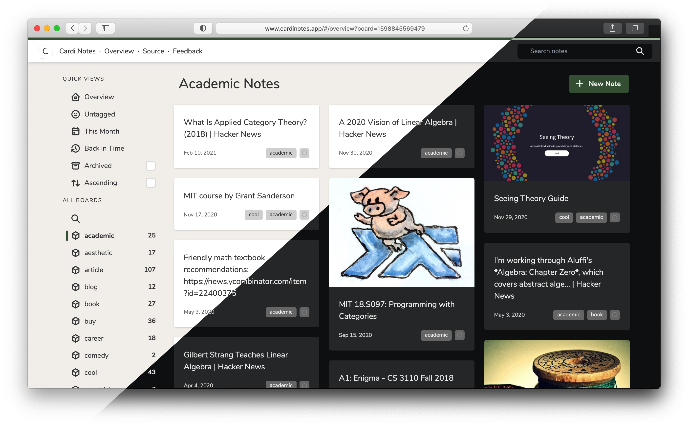

# Cardi Notes

Cardi is a new kind of note keeping tool -- with all data privately stored in your own AWS account, accessible on any device without maintaining your own server, completely open-source and free to use.

## Why This is Weird

All note keeping tools I've seen so far operate on one of a few well-established models:

- **Cloud-based**, where your notes are sent to a 3rd party service for storage
- **Self-hosted**, where you set up and maintain a server that hosts a note-keeping application
- **Local**, where your notes are stored simply as files on a local disk

Each of these solutions has one or more significant compromises in my eyes (centering around privacy, ease of use, and note accessibility), so I set out to make a tool that doesn't have the same disadvantages.

The best idea I was able to come up with involved storing your notes privately, in a DynamoDB table in your own AWS account, while having a web-accessible frontend that's able (using managed access keys and the AWS SDK) to present and update these notes in a user-friendly way. This idea is what turned into Cardi!

## Quick Start

In order to start using Cardi to keep notes, the process is short and simple:

1. Make sure you've created a personal AWS account
    - If you're not up for learning a bit about AWS, that's ok, but may want to try a different solution for now
1. Follow along with the [setup guide](https://github.com/pickledish/cardi/wiki/Setup) to create necessary AWS access keys
    - These keys are only ever stored in your own browser and sent to AWS, **never anywhere else**
1. Visit [cardinotes.app](https://www.cardinotes.app) and enter the new credentials you just created
    - This will automatically create the necessary DynamoDB tables when you first log in

## Features

- Full markdown support in note content
- Assign any number of "boards" (tags) to each note for simple organization
- Ability to archive notes that are no longer relevant
- Automatic fetching of titles for URL notes
- Quick filters based on board and/or date of note creation
- Support for batch archival and tag modification
- Easy and always-available import/export of notes from DynamoDB

## Development

**Requires `npm` version 6.14 or greater to build**

This project is mainly a single-page application, taking advantage of the fantastic open-source libraries [Svelte](https://svelte.dev) to define and build the individual components, [Tailwind](https://tailwindcss.com) for the styling, and [Rollup.js](https://rollupjs.org) as the build system and bundler. This is a pretty standard javascript setup, so you can use `npm install` to install dependencies for the project and `npm run dev` to start a local (live-reloading) server for real-time development.

To create a release-ready bundle for your own deployment of Cardi, run `npm run build`, which will compile all Svelte components to javascript, then render the JS bundle into `public/build`.

Actual releases to [cardinotes.app](https://www.cardinotes.app) are handled via a [Github action](./.github/workflows/workflow.yaml), triggering whenever a commit to `master` is tagged, which builds the site and publishes the artifact to [Netlify](https://www.netlify.com), which hosts the static site and handles SSL certs.

## Contributing

I'm happy to accept any new features or bug fixes to this repository, as long as they don't change the core functionality or requirements of Cardi (whole application is deployed as a static bundle, all application data is stored decentralized in a user's personal cloud account).

In order to contribute, the process should be much the same as for other Github repositories -- fork this repo, make your changes, push, then create a PR against this repo from your fork. I'm still actively working on this project, so I'll be sure to keep an eye on the PRs and get back to you soon!
